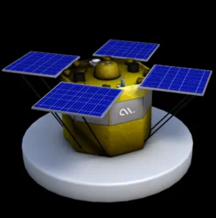
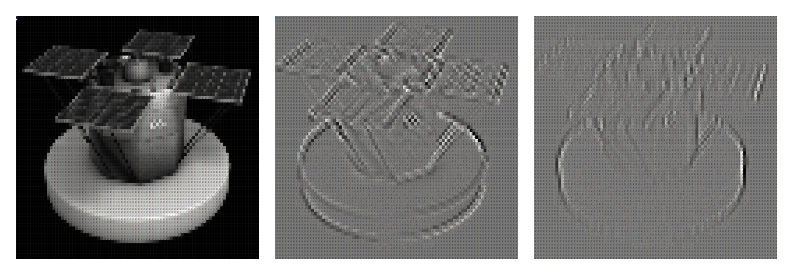
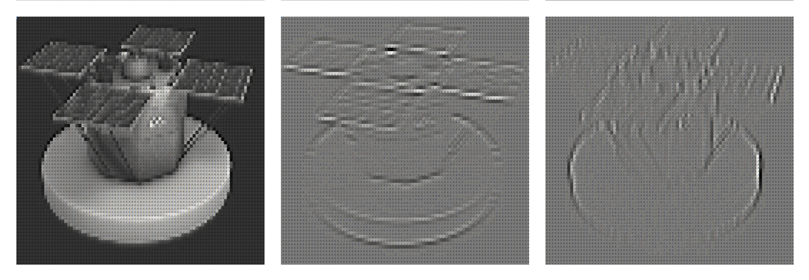
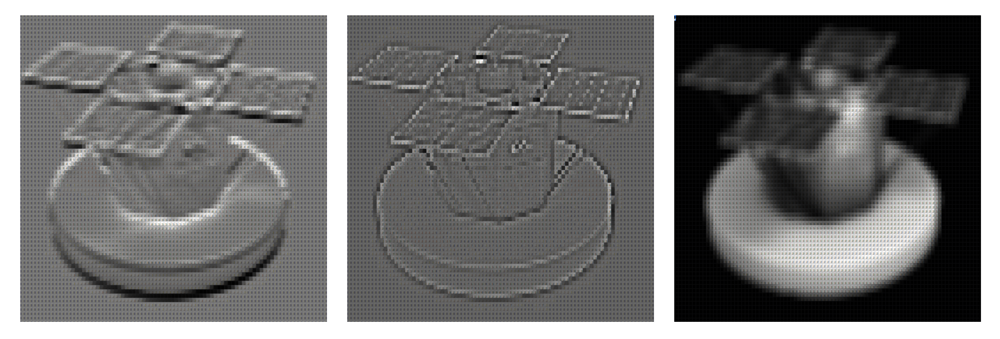
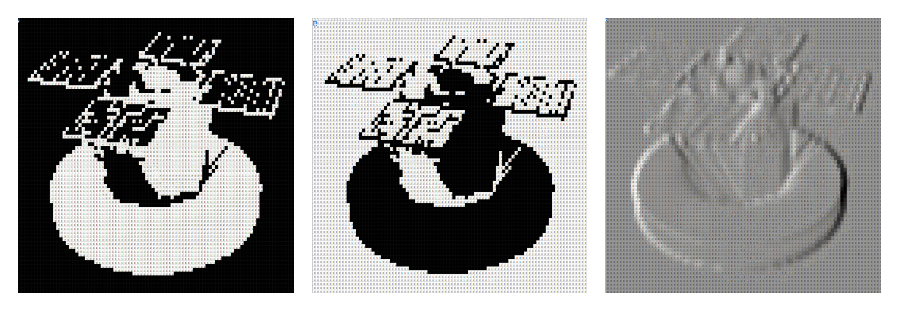

## Computer Vision in Google Sheets
This is a demonstration of different computer vision algorithms applied over [chainsat](https://chainsat.accubits.com/)'s - an ambitious satellite project by ***Accubits Technologies*** - prototype render which is given below. All the kernels are developed using pure Linear Algebra and Google Sheets. Each cell in a Google sheet represents a pixel location of the source image. You can simply visit the following URL and zoom in to see each and every pixel values.

Some of the illustrated operations are

* Thresholding
* Inversion
* Horizontal - Vertical Edge Detection
* Blur
* Sharpening
* Line Detection 

## Results Obtained

You can find the project page [here](https://docs.google.com/spreadsheets/d/1c-NwtyayXyMGZihvmu0Cl-RGKdNUp_9RBmLMym0tVY4/edit?usp=sharing), if you are interested.
